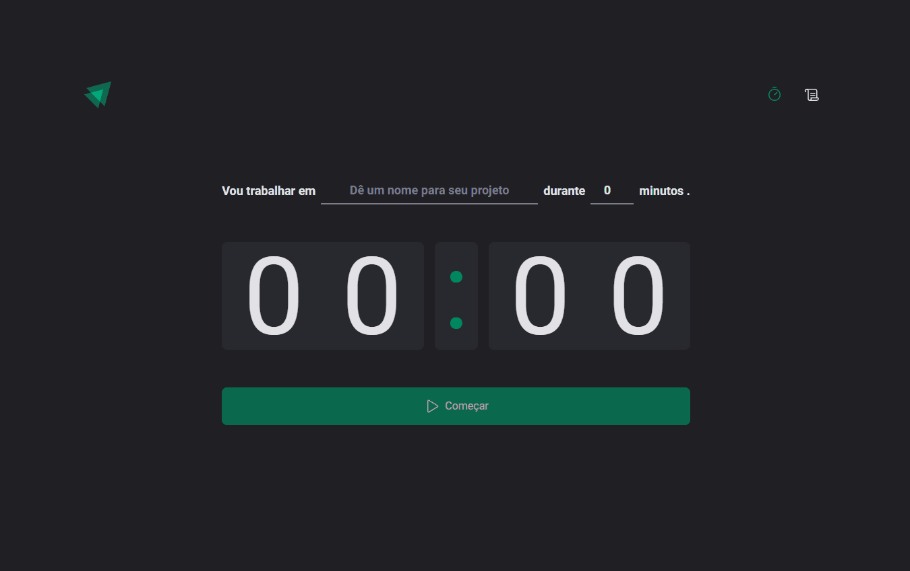

<h1>Estudos Ignite(React) - Etapa 02</h1>

<h3>Tópicos</h3>

<ul>

<li><a href="#course">Projeto feito durante as aulas</a></li> 
<li><a href="#course-individual">Projeto do curso feito individualmente</a></li> 
<li><a href="#external-project">Projeto externo feito individualmente</a></li> 

</ul>

 

<h2 id="course">Projeto feito durante as aulas</h2>

caminho: "/projects/stage02"

 

    Este é um projeto simples de Pomodoro, onde os ciclos são armazenados, e são listados em uma página de histórico. 
    Neste projeto aprendemos ainda mais sobre o React, como trabalhar com formulário, datas, contexto, rotas, utilização do immer para trabalhar 
    com mutabilidade, etc.

<h3>🚀 Tecnologias</h3>
<ul>
    <li>Vite ts</li>
    <li>Tailwind</li>
    <li>Styled-components</li>
    <li>Phosphor-react</li>
    <li>date-fns</li>
    <li>react-router-dom</li>
    <li>react-hook-form</li>
    <li>zod</li>
</ul>

<h3>≠ Diferenças do projeto original</h3>
<ul>
    <li>Organização de pastas e arquivos, contexto principalmente</li>
    <li>Nomenclatura</li>
    <li>Jeitos para resolver de maneira bem diferente</li>
    <li>Etc...</li>
</ul>

 
 
<h2 id="course-individual">Projeto do curso feito individualmente</h2>

caminho: "/projects/practice02"

 

    Este é um projeto de uma cafeteria online. Este projeto foi enviado pela Rocketseat, para praticarmos os conceitos
    aprendidos no primeiro projeto

<h3>🚀 Tecnologias</h3>
<ul>
    <li>Vite ts</li>
    <li>Tailwind</li>
    <li>Styled-components</li>
    <li>Phosphor-react</li>
    <li>date-fns</li>
    <li>react-router-dom</li>
    <li>react-hook-form</li>
    <li>zod</li>
    <li>cleave.js</li>
    <li>headlessui</li>
</ul>

 
 
<h2 id="external-project">Projeto externo feito individualmente, para praticar ainda mais os conceitos</h2>
<a href="https://github.com/dhomini-rabelo/chat">https://github.com/dhomini-rabelo/chat</a>